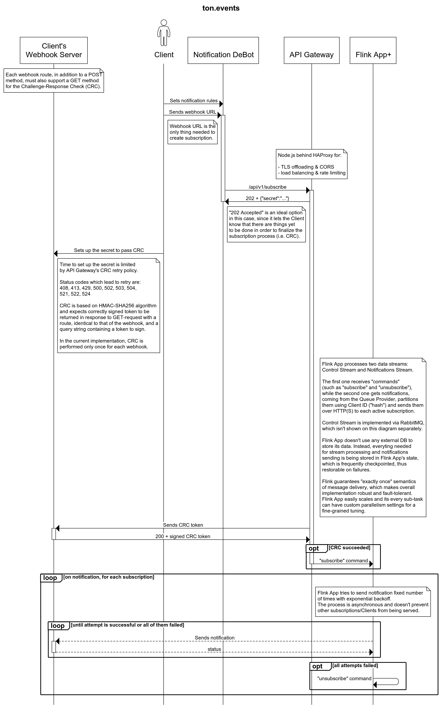

## ton.events &ndash; Notifications Provider for the Free TON Network
Performant, scalable and fault-tolerant system which relays encrypted blockchain events to its clients.

### Submission info
| Name | __ton.events__ |
|:---|:---|
| Description | Notifications Provider for the Free TON Network |
| Telegram | https://t.me/tonevents |
| Github | https://github.com/ton-events |
| Logo | https://ton.events/images/logo.png |
Also obtainable through https://ton.events/about.

### Design considerations

Receiving data from the Queue Provider and dealing with that unbounded stream of notifications, conditionally routed to various destinations, is by definition a data stream processing task.
There are well-known frameworks for solving tasks like this and one of them is [Apache Flink](https://flink.apache.org/), which has been chosen as a tool for the job.

The dataflow program (Flink App for short) run by Flink does the following:

- natively and seamlessly communicates with Kafka to get notifications from the Queue Provider:
    - automatically reconnects in case of connection issues;
    - replays the stream in case of any failures to guarantee that every notification will be processed _exactly once_.
- manages state in a distributed and fault-tolerant manner:
    - no external database is used since everything needed for notifications routing and delivery is stored in a regularly checkpointed [job's state](https://nightlies.apache.org/flink/flink-docs-release-1.14/docs/concepts/stateful-stream-processing/);
    - provides reliable and transparent ways for updating the job without losing any data;
    - allows to configure TTL for each stored entity for a fine-grained control over the size of the state, which is useful, for example, for filtering out duplicated notifications by storing idempotency keys encountered in a given time window.
- provides [asynchronous means](https://ci.apache.org/projects/flink/flink-docs-master/docs/dev/datastream/operators/asyncio/) of sending notifications over HTTP(S) with retries on errors, being performed using configurable retry strategy (see [Appendix A](#appendix-a) for the details on configuration);
- gathers and exposes a huge number of both built-in and user-defined (application-specific) metrics for increased observability of the system; visit [this page](https://ton.events:8086/orgs/00b6088f974b2aca/dashboards/084856f8d2c5c000) to see some of them visualized on the dashboard (username: `spectator`, password: `spectator`).

<div style="page-break-after: always"></div>

To process Notification DeBot requests, i.e. register the webhooks, there's a web service (Node.js) with an API gateway (HAProxy) in front of it (for TLS offloading, CORS and stuff like load balancing and rate limiting).
The web service itself is quite straight-forward and provides only one API route used by Notification DeBot (see [Appendix B](#appendix-b) for a reference).
Specific feature of the web server, worth mentioning, is a webhook ownership confirmation, which technically is a _Challenge-Response Check (CRC)_ based on _HMAC-SHA256_ algorithm. It requires an additional GET-handler for each POST-route (i.e. webhook) on the client's side (see [Appendix C](#appendix-c) for details).
When CRC is successfully completed, the web service sends a "subscribe command" to the control stream, communicating with the Flink App through RabbitMQ.

When the webhook is successfully registered, a client will start receiving notifications. In case of delivery failure, the Flink App will retry, exponentially increasing the delay between attempts (max delay duration is capped so that it won't increase after reaching a configured threshold). Retry process is asynchronous which allows other notifications to be sent without delay.
If every attempt of notification delivery fails, the Flink App will send an "unsubscribe command" to the control stream, effectively forgetting a failing webhook to prevent such struggle in the future. The client will have to add this webhook again, if it's still relevant, or just happily forget about it as well, otherwise.

If the client doesn't receive any messages for a reasonably long time (e.g. due to resetting subscription rules via Notification DeBot), all of their subscriptions are going to be forgotten for good. This is configurable, though, and is a measure which has to be taken, given that Notification DeBot doesn't notify Providers when clients reset their subscription rules.

Those are main design considerations.
In the future, those decisions, hopefully, will allow extending the functionality with new means of notifications delivery such as MQTT, for example, or scale it alongside with the growing client base using Flink's great parallelism capabilities.

[Appendix D](#appendix-d) contains an annotated sequence diagram that visualizes everything said above.

### Notes on testing

Globally available, fully functional version of the Provider lives at https://ton.events.
You can test it by registering webhooks implemented in your own software or those provided for your convenience by a Telegram bot called `@ton_events_playground_bot`.
You might wish to build, deploy and test the system from scratch, which is also possible using a local instance of Kafka (to mock the Queue Provider) and that same Playground Bot.
See [Appendix E](#appendix-e) for details.

<div style="page-break-after: always"></div>

### Appendix A

Configuration of both API service and the Flink App is achieved via environment variables, some of which have default values.

| Variable | Scope | Default value | Description |
| --- | :---: | --- | --- |
| QUEUE_PROVIDER_ADDRESS | Flink App | _None_ | Kafka Bootstrap Server URL |
| QUEUE_PROVIDER_GROUPID | Flink App | ton.events | Kafka Consumer Group ID |
| QUEUE_PROVIDER_TOPIC | Flink App | _None_ | Kafka topic to receive notifications from |
| QUEUE_PROVIDER_USERNAME | Flink App | _None_ | Kafka username |
| QUEUE_PROVIDER_PASSWORD | Flink App | _None_ | Kafka password |
| RETRIABLE_NOTIFICATION_SENDING_ATTEMPTS | Flink App | 3 | How many notification sending attempts to perform after the first failure |
| RETRIABLE_NOTIFICATION_SENDING_INITIAL_DELAY | Flink App | 30 | Delay between the first failure and subsequent retry attempt (in seconds) |
| RETRIABLE_NOTIFICATION_SENDING_MAX_DELAY | Flink App | 600 | Delay will be doubled on each attempt but won't exceed this threshold (in seconds) |
| CRC_RETRY_LIMIT | API | 4 | How many attempts of CRC will be performed |
| CRC_RETRY_INIT_DELAY | API | 30000 | Delay between the first CRC failure and subsequent retry attempt (in milliseconds) |
| CRC_SALT | API | 446f..7921 | Cryptographic salt used to derive client's secret from its _hash_ |
| AMQP_URI | Flink App & API | amqp://rabbitmq.ton.events | See [this](https://www.rabbitmq.com/uri-spec.html) for reference |

### Appendix B

<table>
<thead><tr><th align="left" colspan="2">/api/v1/subscribe</th></tr></thead>
<tbody><tr>
<td>verb: POST</td><td>Response code: 202 Accepted</td></tr>
<tr><td colspan="2">
Request:

```json
{
    "hash": "<string>",
    "data": "<base64 encoded webhook URL>"
}
```

</td></tr><tr>
<td colspan="2">
Response:

```json
{
    "secret": "<64 hexadecimal digits>"
}
```

</td></tr></tbody></table>

<div style="page-break-after: always"></div>

### Appendix C

Inspired by [Twitter](https://developer.twitter.com/en/docs/twitter-api/enterprise/account-activity-api/guides/securing-webhooks) and [LinkedIn](https://docs.microsoft.com/en-us/linkedin/shared/api-guide/webhook-validation).

The webhook registration process ends with a _secret_ being returned to the client. After that, a CRC will be performed.

A `GET` request will be sent to the webhook URL with a query string, containing a parameter called `crc_token`. In response, the client must send that token signed with the _secret_ using _HMAC-SHA256_ algorithm.

Here goes a sample Node.js code that prepares the response:
```js
const crypto = require('crypto');
const hmac = crypto.createHmac('sha256', Buffer.from(secret, 'hex'));

hmac.update(crc_token);

const response = hmac.digest('hex'); // that's important to encode response as HEX
```

Replying with correctly signed token and status code 200 will enable notifications being sent to the client.

Additionally, each notification contains an `x-te-signature` header set to the _HMAC-SHA256_ signature of its body prepended with `hmacsha256=` string. That header is there for the client to make sure notifications are coming from the one and only [ton.events](https://ton.events) and for integrity checks, of course.

### Appendix D



### Appendix E

#### Testing live

Watching [this introductory video](https://youtu.be/77oqFU8ulIA) might be helpful.

If you have your own webhook server, implemented in compliance with [Appendix C](#appendix-c), go and send callback URL(s) to the `tonevents` provider via Notification DeBot.

Otherwise, use the Playground Bot. Like that:

1. Firstly, make sure you have Notification DeBot prepared to receive callback URLs from you as described [here](https://tonlabs.notion.site/Notification-DeBot-User-s-Manual-cbd9f3e1aab74c83850a91335894a2c8).
2. Then, use `@ton_events_playground_bot` to generate a webhook for you &ndash; it happens automatically right after you start conversing with the bot.
    Keep in mind that __the callback URL is always the same for a given chat id__, so if you want to get multiple callbacks for some testing scenarios, you have to create multiple groups with the bot. Note that adding the bot to a group doesn't call the `/start` command automatically, so you need to do it manually like that:
    ```
    /start@ton_events_playground_bot
    ```
    Also keep in mind that if you decide to use an approach with groups (instead of a private chat), __you have to explicitly reply to the bot's messages__, when providing information it asks for.
3. When you got the URL, feed it to Notification DeBot (`Send callbackUrl` command, ID = `tonevents`).
4. If the URL is valid, Notification DeBot will reply with a JSON (containing a secret), which must be re-sent as-is to the Playground Bot as soon as possible. The time is limited because of the CRC, which starts at the same time the client receives the secret. There will be multiple attempts with delays so take your time but don't hesitate too long.
5. As soon as the Playground Bot receives the valid secret, it will start showing all the notifications you're subscribed for, so don't forget to set up some rules via Notification DeBot. For example, you could subscribe to `all` events for your DevNet wallet and then send some tokens to/from it.
6. _Optionally_, you can provide the Playground Bot with the key pair you received from Notification DeBot when your Notification contract was deployed for the first time. It's not recommended to share it with anybody in real life but for the testing purposes in DevNet it's quite harmless. Being provided with that key pair, the Playground Bot would be able to decrypt incoming notifications for you.

<div style="page-break-after: always"></div>

#### Testing locally

Prerequisites:
- OS that supports everything listed below
- Docker & Docker Compose
- [jq](https://stedolan.github.io/jq/)
- ports `13000/tcp`, `18081/tcp` unoccupied on `127.0.0.1`

Inside the submission's root folder (containing `docker-compose.yml` file) execute the following command:
```shell
$ docker-compose up -d
```
This will build all the Docker images and bring the services up.

Now you need to build and deploy the Flink App. Do the following:
```shell
$ docker run --rm -v $PWD/core:/usr/src/app -w /usr/src/app clojure:openjdk-8-lein lein uberjar
$ ./flink-app-reload.sh core/target/ton-events-1.0.0-SNAPSHOT-standalone.jar
```

This is it for the setup work. Now refer to the step 2 of the [Testing live](#testing-live) section to generate a callback URL via Playground Bot. When it's ready, do the following:
```shell
$ ./register-callback.sh <your callback URL goes here>
```
A JSON with a _secret_ will be printed in response &ndash; feed it back to the Playground Bot (full JSON, replying explicitly, if in a group).
Now everything is ready to mock some notifications:
```shell
$ docker-compose exec kafka produce-notifications.sh
```
The command above will send three notifications, two of which have the same idempotency key (to test deduplication). You'll receive only two notifications &ndash; go check your Telegram for new messages from the Playground Bot.
If you run the above command again, you won't receive notifications because of idempotency keys duplication. To change that, go edit [produce-notifications.sh](kafka/bin/produce-notifications.sh) and modify those keys. Note that without any notifications being sent for approximately an hour, you'll be able to receive notifications without modifying the keys, since uniqueness of the keys is being checked in a fixed time window.

To shut everything down and/or start from scratch do the following.
```shell
$ docker-compose down -v
```
