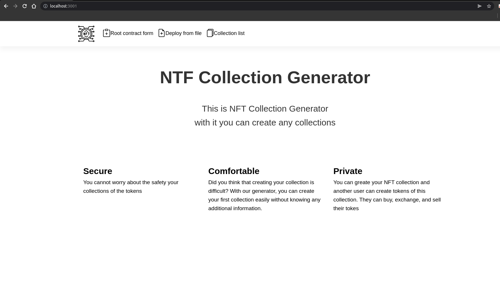
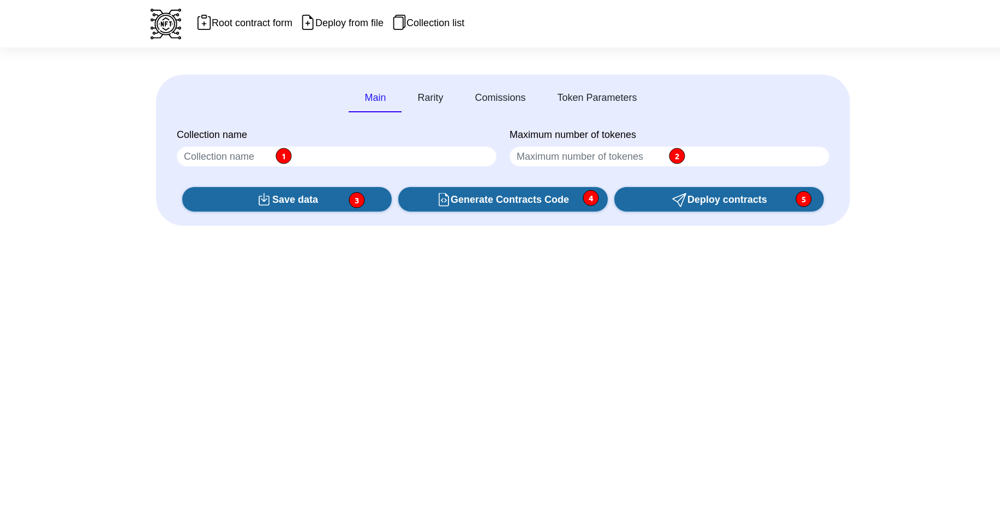
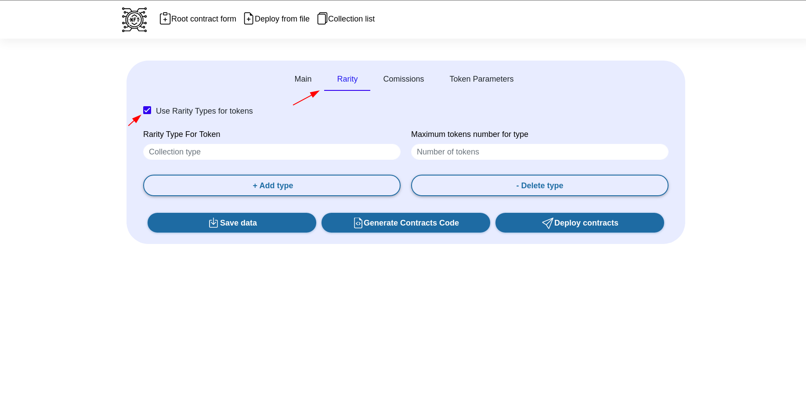
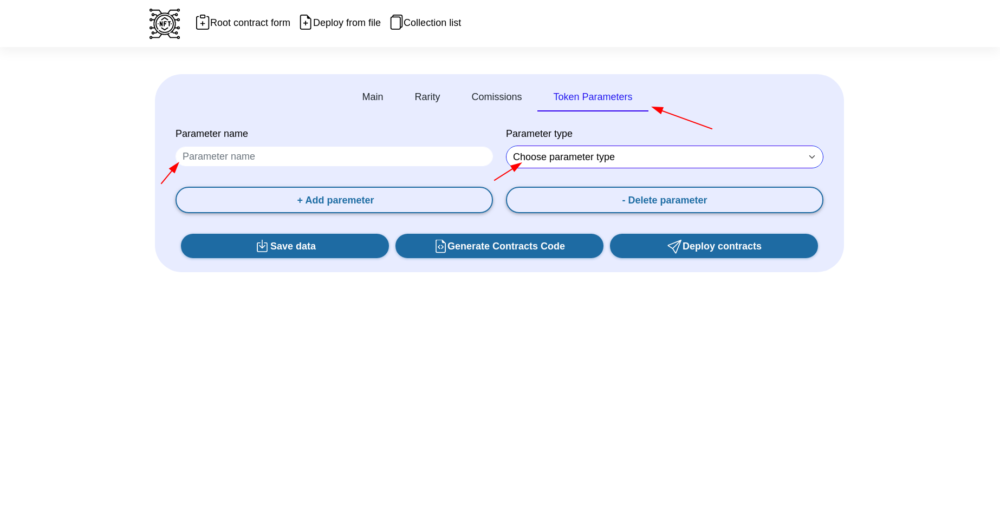
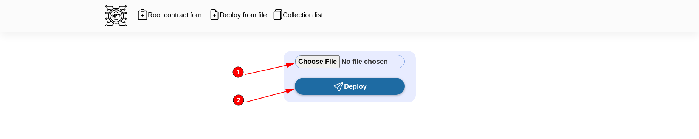
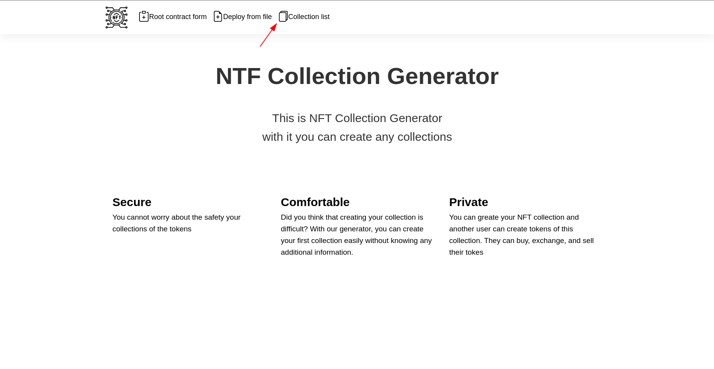
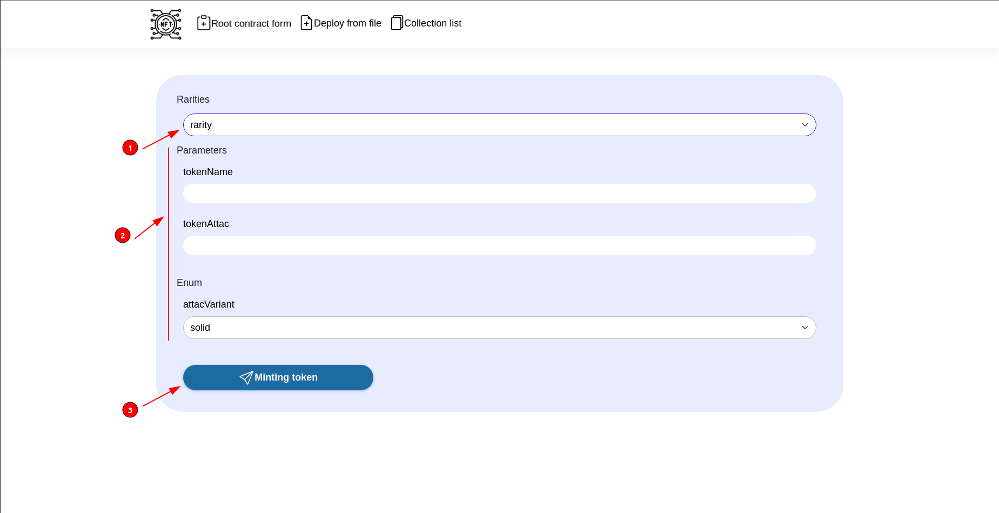
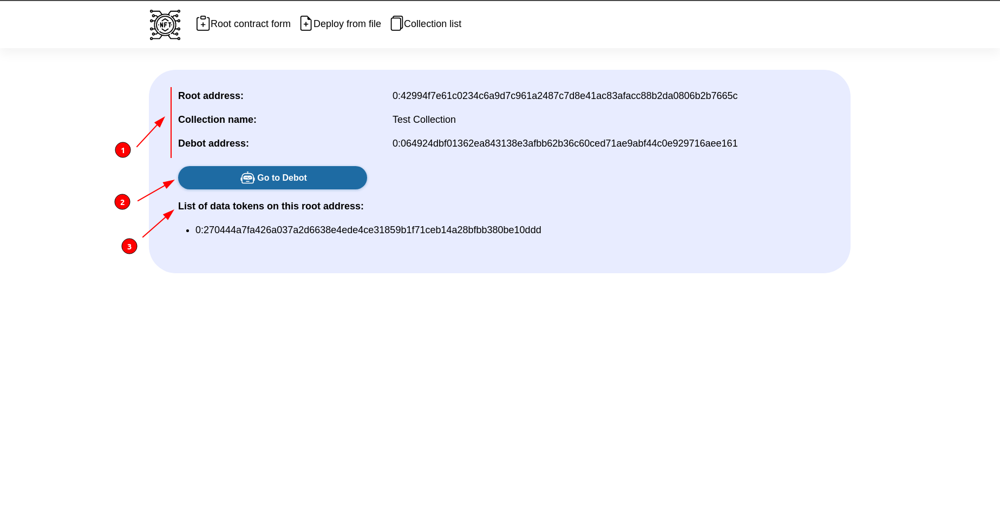
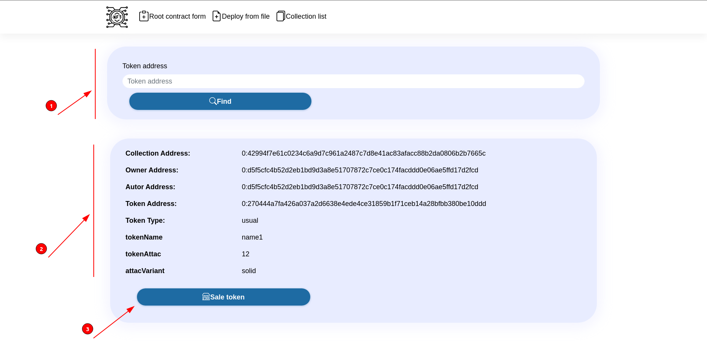
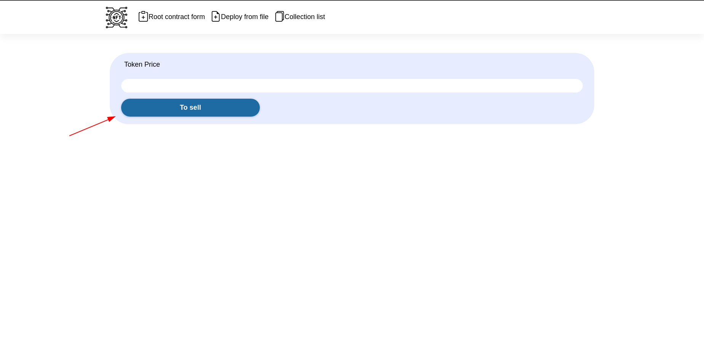

#  NFT_collection_distributor

# Table of content
- [How to use](#how-to-use)
- [How to create a token generator](#how-to-create-a-token-generator)
	- [General information about collection](#general-information-about-collection)
	- [Add rarity to the tokens](#add-rarity-to-the-tokens)
	- [Parameters](#parameters)
- [How to create token generator from JSON file](#how-to-create-token-generator-from-JSON-file)
- [How to create your tokens](#how-to-create-your-tokens)
	- [Token minting](#token-minting)
	- [Information about token](#information-about-token)
	- [Sale tokens](#sale-tokens)
- [How to run tests](#how-to-run-tests)

## How to use
1. Clone repository
2. Run `npm install`
3. Go to */src/config/everscale-settings.ts* and set your parameters
4. Run `npm run build`
5. Run `npm run start`
6. Go to the `localhost:3001`

## Detailed description
---
First of all you need to create a token generator.
# How to create a token generator

After you went to the main page, click on the button `Root contract form` to go to the page for creating a token generator.

## General information about collection
In the `Collection Name` field (marked 1), enter the name of the collection you create. And in the `Maximum number of tokenes` field (marked 2) enter  maximum number of tokenes you want to create.
After filling out data about your collection you  can click on one of the buttons: 
 - `Save data` button (marked 3) to create a data about you collection in JSON format.
 - `Generate contract code` button (marked 4) to generate code of your collection, **without contracts deployment**,  wich will be saved in the `*/results/collections/collection_address/` folder, where `collection_address` is the address of your token generator.
 - `Deploy contracts` button (marked 5) to deploy your collection in the blockchain. **The token generator and debot contracts will be created and deployed.**

## Add rarity to the tokens
When you clicked on the `Rarity` tab, you can add the degree of value to the tokens from your collection. 
To do this, click on the tick `Use Rarity Types for tokens`. 
 - In the `Collection type` and  `Number of tokens` fields, enter the name of the type and the tokens number of this type respectively.
 - You can add and delete the type of tokens with buttons `Add type` and `Delete type` respectively.
 
## Parameters
You can add any parameters for each token, to do this, click on the `Token Parameters` tab.
Enter the parameter name to the `Parameter name` field and select the parameter type in the drop-down `Choose parameter type` list. You can add several parameters of different types.

# How to create token generator from JSON file
---
1) Click to the `Deploy from file` button to generate your collection from JSON file. Your collection will be saved in the `*/results/collections/collection_address/` folder where `collection_address` is the address of your token generator

2) Click to the `Choose file` field (marked 1) to select JSON file and then cick the `Deploy` button (marked 2) to deploy your collection.

# How to create your tokens
---
1) To show collection list you have click to the `Collection list` button.

2) You can see the collections list you have. You can have more then one collection. 
- To mint token of collection click to the `Minting token` button.
- To get information about collection click to the `Info Root` button.

## Token minting
1) When you clicked to the `Minting token` button, you will go to the minting page.
- In the drop-down list (marked 1) , you need to select one of the rariry type that you entered when creating a token generator.
- Then you need to fill the parameters for token (marked 2).
- Click to the `Minting token` button (marked 3) to create your token.

2) if you clicked on the  `Minting token` button your token is created and you are in the `Generator info` page. Here you would have been if you click on the `Info root` button. On this page you can: 
- find general information (marked 1) about your collection such as `Root address`, `Collection name`, `Debot address`.
- go to the debot for also to create tokens (marked 2).
- see information about each token by clicking on the address of the token in the list (marked 3).

## Information about token
We will go to the `Token information` page if you clicked to the address of the token in the tokens list. On this page you can:
- find information about an another token if you enter the an another token address in the field (marked 1)  
- see information about this token in the field with information (marked 2) 
- sale token by clicking to the `Sale token` button (marked 3)

## Sale tokens
You can set the price of your token and sell it. 

# How to run tests
Execute `python -m unittest -v` from */src/contracts/tests* (TestSuite4 required)