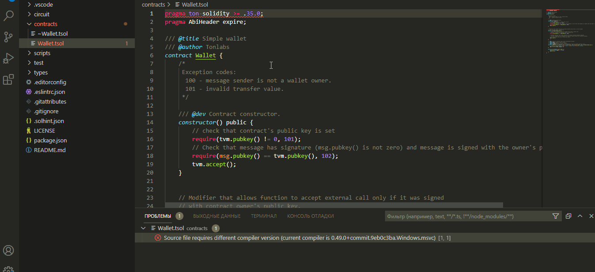

# TON Solidity support for Visual Studio code

**Files must have `.tsol` extension**

<div align="center">
  
</div>

[](https://marketplace.visualstudio.com/items?itemName=mytonwallet.ton-solidity-extension)  [](https://marketplace.visualstudio.com/items?itemName=mytonwallet.ton-solidity-extension) [](https://marketplace.visualstudio.com/items?itemName=mytonwallet.ton-solidity-extension) [](https://marketplace.visualstudio.com/items?itemName=mytonwallet.ton-solidity-extension#review-details)



TON Solidity is the language used in Free TON project to create smart contracts.
This extension use extended Solidity language and provides: 

* Syntax highlighting
* Own extension `.tsol` that allows working with Solidity code and TON Solidity language extension
* Snippets
* Code completion for all contracts / libraries in the current file and all referenced imports
* Code completion for all variables, functions, global parameters and unique types for TVM
* Linting using Solhint or Solium
* Covered all extension for TON compiler accordance with https://github.com/tonlabs/TON-Solidity-Compiler/blob/master/API.md
* Built in compiler with auto compilation tvc + abi.json files

# Instructions

## Code completion

Autocomplete is generally supported across for smart contracts, structs, functions, events, variables, using, inheritance. Autocomplete should happen automatically or press Ctrl+Space or Command+Space in areas like "import".


## Auto compilation and error highlighting

Auto compilation of files and error highlighting can be enabled or disabled using user settings. Also a default delay is implemented for all the validations (compilation and linting) as ton-solidity compilation can be slow when you have many dependencies.

```
"tonsolidity.enabledAsYouTypeCompilationErrorCheck": true,
"tonsolidity.validationDelay": 1500
```

## Linting

There are two linters included with the extension, solhint and solium / ethlint. You can chose your preferred linter using this setting, or disable it by typing ''

### Solhint

To lint ton solidity code you can use the Solhint linter https://github.com/protofire/solhint, the linter can be configured it using the following user settings:

```json
"tonsolidity.linter": "solhint",
"tonsolidity.solhintRules": {
  "avoid-sha3": "warn"
}
```

This extension supports `.solhint.json` configuration file. It must be placed to project root 
directory. After any changes in `.solhint.json` it will be synchronized with current IDE 
configuration. 

This is the default linter now.

NOTE: Solhint plugins are not supported yet.

### Solium / Ethlint

Solium is also supported by the extension https://github.com/duaraghav8/Solium, you can configure it using the following user settings:

```json
"tonsolidity.linter": "solium",
"tonsolidity.soliumRules": {
    "quotes": ["error", "double"],
    "indentation": ["error", 4]
},
```

## Contributing / Issues / Requests

For ideas, issues, additions, modifications please raise an issue or a pull request at https://github.com/mytonwallet/vscode-tonsolidity-extension

# Requested features

- [ ] Show Hovers
- [ ] Help With Function and Method Signatures
- [ ] Possible Actions on Errors or Warnings
- [ ] Incrementally Format Code as the User Types
- [ ] Cut out parser, linter and other packages and create new separated